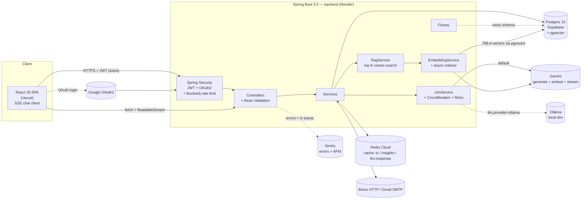
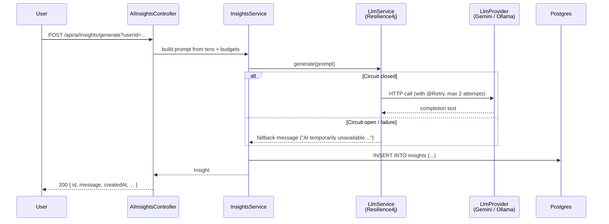
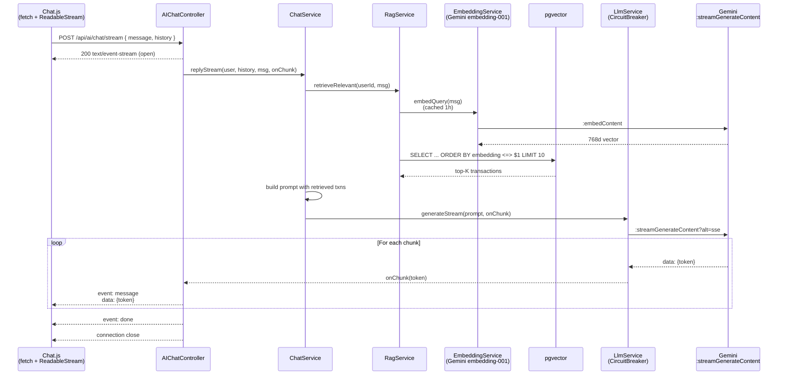
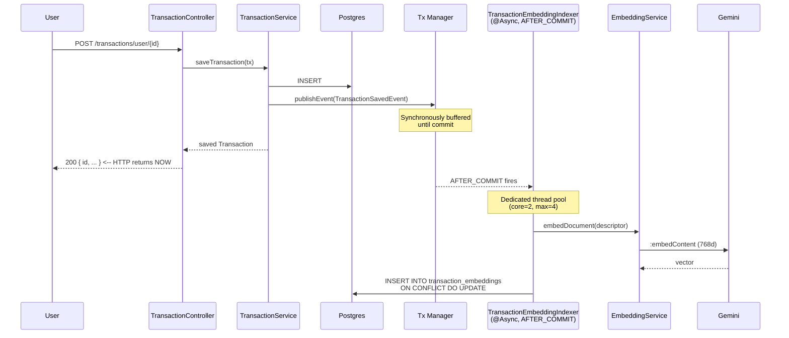

# Finora — AI-powered personal finance dashboard

> A full-stack personal-finance app: track transactions, set budgets, and get LLM-generated financial insights against your own data. Built to demonstrate production-grade Spring Boot + React patterns — JWT + OAuth2 + OTP auth, Flyway-managed schema, circuit-breaker-protected LLM calls, validated REST APIs documented with OpenAPI.

[](https://finora-frontend-smoky.vercel.app)
[](https://finora-backend-rnd0.onrender.com/swagger-ui.html)
[](https://finora-backend-rnd0.onrender.com/actuator/health)
[](.github/workflows/backend-ci.yml)
[](.github/workflows/frontend-ci.yml)

---

## Live demo

- **Frontend:** https://finora-frontend-smoky.vercel.app
- **API (Swagger UI):** https://finora-backend-rnd0.onrender.com/swagger-ui.html
- **Health probe:** https://finora-backend-rnd0.onrender.com/actuator/health

> Render's free tier sleeps the backend after ~15 minutes of inactivity. The first request after a sleep can take 30–60 s to wake the dyno; subsequent calls are instant.

---

## Highlights

### Auth & security
- Email + password with BCrypt, Google OAuth2, email OTP signup verification
- Brute-force lockout (5 failures → 15 min), single-use SHA-256-hashed password-reset tokens
- Bucket4j rate limiting on auth + LLM endpoints (per-IP for auth, per-user for LLM)
- 401 JSON for `/api/**` (not 302 to login HTML) so XHR clients can react cleanly

### AI surface (the headline)
- **Conversational chat with SSE streaming** — `/api/ai/chat/stream` returns `text/event-stream`; tokens render incrementally in the UI as Gemini emits them
- **RAG over user transactions** — pgvector + Gemini `gemini-embedding-001` (768d). Chat questions retrieve top-K relevant rows by cosine similarity instead of dumping the recent 30
- **Async embedding pipeline** — every transaction save fires a `TransactionSavedEvent`; an `@Async @TransactionalEventListener(AFTER_COMMIT)` embeds the row on a dedicated thread pool *after* the DB tx commits. The user's HTTP save returns instantly
- **Vendor-neutral LLM layer** — `LlmProvider` interface (Gemini + Ollama). Resilience4j circuit breaker + retry + 1h Redis cache for identical prompts → cache hits resolve in <5ms
- **Subscription detector** — groups expense transactions by (description, ±5% amount) and flags consistent weekly/monthly/yearly cadence
- **Anomaly detection** — per-category z-score over a 90-day window, severity tiers at z≥2 (moderate) and z≥3 (severe)
- **Cash-flow forecast** — 30-day projection combining salary day-of-month, projected subscription charges, and discretionary daily average

### Performance & reliability
- **Redis caching** — 13× p95 latency reduction on hot reads ([loadtests/results.md](./loadtests/results.md)); per-cache TTLs tuned for write/read frequency; cache failures swallowed by `CacheErrorHandler` so a sick Redis never 500s a request
- **Composite indexes + pagination** — `idx_transactions_user_date (user_id, transaction_date DESC)` satisfies the dashboard query from a single index lookup; `Page<Transaction>` envelope on user-facing endpoints, size-capped at 100
- **Resilience4j** — circuit breaker shared across chat / embedding / insight calls, so a sick Gemini brakes everything together; graceful fallback message instead of a 500
- **k6 load tests** — `loadtests/` documents p50/p95/p99 thresholds for every perf claim in this README

### Engineering rigor
- **Schema-managed** — Flyway migrations, `ddl-auto=validate` so Hibernate never silently mutates the live database
- **Self-documenting API** — Springdoc OpenAPI generates `/v3/api-docs`, browsable Swagger UI with bearer-JWT auth scheme
- **Validated everywhere** — Bean Validation on every request DTO with field-level error responses (`{"fields": {"email": "..."}}`)
- **Observable** — Spring Boot Actuator health/info, Sentry on FE + BE, structured `RestControllerAdvice` error envelope
- **Tested** — JUnit 5 + Mockito unit tests + a Spring Boot context-load test against H2; `./mvnw test` runs 25 tests in ~35 s

---

## Architecture



### OTP signup flow

```mermaid
sequenceDiagram
    participant U as User (browser)
    participant API as Backend
    participant DB as Postgres
    participant SMTP as Gmail SMTP

    U->>API: POST /api/auth/request-otp { email }
    API->>DB: deleteByEmail; INSERT otp_codes (code, expires_at = now+5m)
    API->>SMTP: send 6-digit code
    API-->>U: 200 { resendCooldownSeconds: 15 }
    U->>API: POST /api/auth/verify-otp { email, code }
    API->>DB: SELECT latest otp; check expiry & match
    API->>DB: UPDATE users SET verified=true
    API-->>U: 200 { message: "Email verified" }
    U->>API: POST /api/auth/signup { name, email, password }
    API-->>U: 200 { message: "Account created" }
```

### AI insight generation (with circuit breaker)



### Chat with SSE streaming + RAG retrieval



### Async transaction embedding (write path)



---

## Architecture decisions

The non-obvious calls — when JdbcTemplate beats JPA, why we picked
`fetch + ReadableStream` over `EventSource`, when caches should swallow
errors — are documented as ADRs in [`docs/adr/`](./docs/adr/).

| # | Decision | Why it's interesting |
|---|---|---|
| [0001](./docs/adr/0001-vendor-neutral-llm-provider.md) | Vendor-neutral `LlmProvider` | Swap providers via env var; circuit breaker shared across chat / embed / insight |
| [0002](./docs/adr/0002-redis-cache-with-graceful-degrade.md) | Redis cache w/ graceful degrade | A Redis blip is `WARN` log, not user-facing 500 |
| [0003](./docs/adr/0003-pgvector-with-jdbctemplate.md) | pgvector + JdbcTemplate | JPA + pgvector is awkward; the DAO surface is small enough that raw SQL is the right tool |
| [0004](./docs/adr/0004-async-embedding-via-transactional-event.md) | `@TransactionalEventListener(AFTER_COMMIT)` async embedding | HTTP save returns instantly; embedding only fires after commit |
| [0005](./docs/adr/0005-sse-streaming-via-fetch-not-eventsource.md) | `fetch + ReadableStream` for SSE | `EventSource` can't carry the `Authorization` header; rolled our own SSE parser instead |
| [0006](./docs/adr/0006-per-category-z-score-anomaly-detection.md) | Per-category z-score for anomalies | Global framing flags rent forever; per-category keeps signal honest |
| [0007](./docs/adr/0007-extracted-ai-service-over-rabbitmq.md) | Extracted `ai-service` over RabbitMQ | Slow Gemini calls no longer pin a backend request thread; explicit reply queue + correlationId for visibility in `rabbitmq-management` |

---

## Tech stack

| Layer | Choice | Why |
|---|---|---|
| Frontend | React 18, React Router 7, **Tailwind 3.4 + shadcn/ui**, Framer Motion, Chart.js | Distinctive design, polished animations, dark/light theming via HSL CSS variables |
| Backend | Spring Boot 3.5 (Java 17) | Mature, security-first, hireable |
| DB | Postgres 15 (Supabase) + Flyway + composite indexes + **pgvector** | Relational, ACID, schema-managed; pgvector for RAG with HNSW cosine ANN search |
| Cache | Spring Cache + Redis (Redis Cloud) | 13× p95 latency reduction on hot reads; per-cache TTLs (5min for tx/insights, 1h for `llm:response`) |
| Auth | JWT (jjwt) + OAuth2 (Spring Security) + email OTP | Stateless, mobile-friendly, real-world auth surfaces |
| Email | Vendor-neutral `EmailProvider` (SMTP / Brevo HTTP API) | HTTP fallback for hosts that block outbound SMTP |
| Rate limiting | Bucket4j (token bucket) on auth + LLM + RAG-backfill endpoints | Abuse prevention with Retry-After 429 envelope |
| API docs | Springdoc OpenAPI / Swagger UI | Auto-generated, browsable, recruiter-shareable |
| Resilience | Resilience4j (circuit breaker + retry) | Fault-isolation around LLM + embedding calls — both share the same `llm` breaker |
| LLM | Google Gemini 2.0 Flash + `gemini-embedding-001` (free tier) with local Ollama fallback | Free; provider-neutral interface; streaming via `:streamGenerateContent?alt=sse` |
| RAG | pgvector + JdbcTemplate (vector(768)) + HNSW index | JPA + pgvector is awkward; JdbcTemplate keeps the DAO surface small |
| Async | `ThreadPoolTaskExecutor` (embedding pool: core=2, max=4, queue=50, CallerRunsPolicy) | Embedding doesn't block the HTTP save thread; backpressure on sustained burst |
| Validation | Jakarta Bean Validation | Field-level error envelope |
| Observability | Spring Boot Actuator + Sentry (errors + APM) | `/actuator/health` probes; Sentry events on errors + tx traces |
| Load testing | k6 ([loadtests/](./loadtests/)) | Documented p50/p95/p99 numbers for every perf claim in this README |
| Tests | JUnit 5, Mockito, AssertJ, H2 in-memory | Fast, no external deps; 25 tests pass in ~35 s |
| Hosting | Vercel (FE) · Render (BE) · Supabase (Postgres + pgvector) · Redis Cloud · Brevo · Sentry — all free tier | Zero-cost deploy story |
| CI/CD | GitHub Actions → Maven build & test → Render deploy webhook | Deploy on every green main push |

---

## Quick start

### Prerequisites
- Java 17 · Maven (uses bundled `./mvnw`)
- Node 20 · npm
- Postgres 15 *or* a free [Supabase](https://supabase.com) project (recommended), *or* Docker (`docker run -p 5432:5432 -e POSTGRES_PASSWORD=postgres -e POSTGRES_DB=finora postgres:15`)
- A free [Gemini API key](https://aistudio.google.com/apikey) (or run [Ollama](https://ollama.com) locally with `ollama pull mistral:7b`)

### Backend

```bash
cd backend
cp .env.example .env       # fill in real values
./mvnw spring-boot:run     # localhost:8081
```

Then open:
- API: http://localhost:8081/swagger-ui.html
- Health: http://localhost:8081/actuator/health

### Frontend

```bash
cd frontend
cp .env.example .env       # set REACT_APP_API_URL=http://localhost:8081/api
npm install
npm start                  # localhost:3000
```

### Tests

```bash
cd backend
./mvnw test                # 25 tests, ~35s
```

---

## Project layout

```
backend/
  src/main/java/com/project/financeDashboard/
    config/        Spring Security, JWT, OpenAPI, RestTemplate, RedisCacheConfig,
                   RateLimitConfig + Interceptor + Rule, AsyncConfig (embedding +
                   backfill thread pools)
    controller/    REST endpoints — Auth, Transactions, Budgets, AI Insights/Chat,
                   Subscriptions, Anomalies, Forecast, RagAdmin, DemoSeed (temp)
    dto/           Request/response DTOs + DetectedSubscription / DetectedAnomaly /
                   ForecastPoint records
    event/         TransactionSavedEvent (published on save, drives RAG indexer)
    exception/     GlobalExceptionHandler — uniform JSON error envelope
    model/         JPA entities
    repository/    Spring Data JPA repos
    security/oauth/   Google OAuth2 success/failure handlers, custom resolver
    service/
      llm/         LlmProvider interface + Gemini (incl. streaming) & Ollama impls
                   + LlmService (CircuitBreaker + Retry + Cache)
      rag/         EmbeddingProvider + GeminiEmbeddingProvider (768d, taskType
                   = RETRIEVAL_DOCUMENT), EmbeddingService (cached query embed),
                   TransactionEmbeddingDao (JdbcTemplate <=> ANN search),
                   TransactionEmbeddingIndexer (@Async @TransactionalEventListener
                   AFTER_COMMIT), RagBackfillService (paced bulk embed),
                   RagService (top-K retrieval w/ graceful degrade)
      SubscriptionDetectorService, AnomalyDetectorService, CashFlowForecastService,
      ChatService, UserService, TransactionService, BudgetService, InsightsService,
      MailService, PasswordResetService
    validation/    @StrongPassword annotation + validator
  src/main/resources/
    application.properties
    db/migration/  V1__init_schema, V2__password_reset, V3__composite_indexes,
                   V4__pgvector_transaction_embeddings
  src/test/...     JUnit 5 + Mockito + H2 — 25 tests, ~35 s

frontend/
  src/
    pages/         Dashboard (hero stats + insight + breakdown + Anomalies +
                   Forecast + Subscriptions + Recent), Transactions, Budgets,
                   Chat (SSE streaming + RAG status badge), AIInsights, Profile,
                   Login, Signup, OAuth, SetPassword, ForgotPassword, ResetPassword
    components/    sidebar, app-layout, ui/* (Card, Button, Input, Label, MoneyValue),
                   theme-provider, auth-layout, auth-message
    context/       AuthContext (JWT-aware session restore with skipAuthRedirect
                   on cold-start /auth/me)
    services/      api.js (axios + JWT interceptor + 401 → /login session-expired
                   bounce), authService, transactionService, budgetService, aiService,
                   chatService (sendStream via fetch + ReadableStream),
                   subscriptionService, anomalyService, forecastService

docs/
  adr/             Architecture Decision Records — see docs/adr/README.md
```

---

## Roadmap

- **Phase 1** — OpenAPI, Actuator, Bean Validation, password policy + reset, LLM provider abstraction with circuit breaker, Flyway, real tests, env examples ✅
- **Phase 2** — Redis caching ✅, Bucket4j rate limiting ✅, pagination + composite indexes ✅, Tailwind + shadcn UI rebuild ✅, Sentry FE+BE ✅, k6 load tests ✅
- **Phase 3** — Conversational AI chat with SSE streaming ✅, RAG over user transactions (pgvector + Gemini embeddings) ✅, subscription detector ✅, anomaly detection ✅, cash-flow forecast ✅
- **Phase 3.4** — `ai-service` extracted over RabbitMQ ✅ (insight flow; embedding + chat to follow incrementally)
- **Phase 4 (current)** — ADRs ✅, Mermaid sequence diagrams ✅, performance numbers in README ✅, demo Loom (TODO)

---

## What I learned

### From Phase 1
- Designing a vendor-neutral LLM abstraction so the production LLM can be swapped without touching business logic
- Adopting Flyway against a database that was previously schema-managed by `ddl-auto=update` without losing data
- Returning structured field-level error envelopes from `@RestControllerAdvice` for a smoother frontend integration
- Why the circuit-breaker → fallback pattern matters more than retries alone when the upstream is a paid/quota'd API

### From Phase 2
- Spring Cache `@CacheEvict(allEntries=true)` is the right default for low-write-volume domains — narrowing eviction is bookkeeping that costs more than it saves
- Composite indexes on `(user_id, transaction_date DESC)` keep the dashboard's "last N transactions" query a single index lookup even at 100k+ rows
- A `CacheErrorHandler` that swallows Redis failures and falls through to the underlying service is the difference between "Redis blip" and "outage"
- Bucket4j's `tryConsumeAndReturnRemaining` gives us the `Retry-After` header the spec expects, no manual stopwatch needed

### From Phase 3
- Streaming over `:streamGenerateContent?alt=sse` requires `java.net.http.HttpClient`, not `RestTemplate` — RestTemplate buffers the full body before returning, defeating streaming
- pgvector + JPA is awkward (Hibernate doesn't natively know about `vector`); JdbcTemplate with `?::vector` casts is simpler than a custom UserType for the small DAO surface
- `@TransactionalEventListener(AFTER_COMMIT)` requires an active transaction at the publish site — without `@Transactional` on the publishing method, Spring silently drops the event
- React effect order is **children before parents** — a parent provider's "clean up stale token" effect can wipe a child's freshly-set token if you're not careful (caught this exact bug in the OAuth callback path)
- Per-category z-scoring keeps anomaly signal honest: a ₹5000 grocery run is unremarkable, a ₹5000 coffee is not — globally framed, you can't tell

### From shipping
- Render's free tier sleeps after ~15 min and SMTP is blocked by their ISPs — a `Brevo` HTTP fallback for OTP email is the difference between "works on localhost" and "works in prod"
- `text-embedding-004` was deprecated mid-2025; current name is `gemini-embedding-001` (3072d default — must request 768 via `outputDimensionality` to match the pgvector column)
- `process.env.CI=true` on Vercel + CRA = "warnings as errors" — added `cross-env CI=false` to the build script so style warnings don't fail the build

---

## Author

**Karma Patel** · 3rd year, Cloud & Application Development · [github.com/patelkarma](https://github.com/patelkarma)
