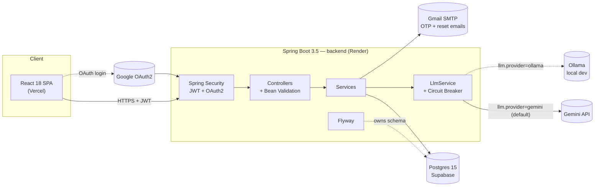
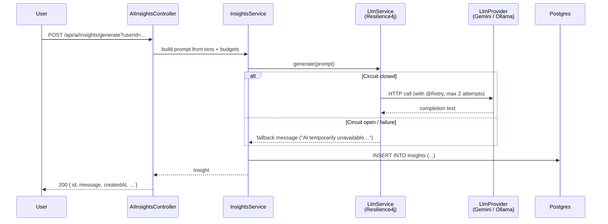

# Finora — AI-powered personal finance dashboard

> A full-stack personal-finance app: track transactions, set budgets, and get LLM-generated financial insights against your own data. Built to demonstrate production-grade Spring Boot + React patterns — JWT + OAuth2 + OTP auth, Flyway-managed schema, circuit-breaker-protected LLM calls, validated REST APIs documented with OpenAPI.

[](https://finora-frontend.vercel.app)
[](https://finora-backend-rnd0.onrender.com/swagger-ui.html)
[](https://finora-backend-rnd0.onrender.com/actuator/health)
[](.github/workflows/backend-ci.yml)
[](.github/workflows/frontend-ci.yml)

> ⚠️ **Update the badge URLs and the live link above** to your real Vercel/Render URLs after the next deploy. Placeholders are wired to the existing `finora-frontend.vercel.app` / `finora-backend-rnd0.onrender.com` hosts.

---

## Live demo

- **Frontend:** https://finora-frontend.vercel.app
- **API (Swagger UI):** https://finora-backend-rnd0.onrender.com/swagger-ui.html
- **Health probe:** https://finora-backend-rnd0.onrender.com/actuator/health

> Render's free tier sleeps the backend after ~15 minutes of inactivity. The first request after a sleep can take 30–60 s to wake the dyno; subsequent calls are instant.

---

## Highlights

- **Auth depth** — email + password with BCrypt, Google OAuth2, email OTP signup verification, brute-force lockout (5 failures → 15 min), single-use SHA-256-hashed password-reset tokens
- **Vendor-neutral LLM layer** — `LlmProvider` interface with two implementations (Google Gemini Flash, local Ollama). Selected at boot via `llm.provider`. Wrapped with Resilience4j circuit breaker + retry, fails over to a graceful fallback message instead of a 500
- **Schema-managed** — Flyway migrations, `ddl-auto=validate` so Hibernate never silently mutates the live database
- **Self-documenting API** — Springdoc OpenAPI generates `/v3/api-docs`, browsable Swagger UI with bearer-JWT auth scheme
- **Validated everywhere** — Bean Validation on every request DTO with field-level error responses (`{"fields": {"email": "..."}}`)
- **Observable** — Spring Boot Actuator with public health/info endpoints; structured `RestControllerAdvice` error envelope; SLF4J logging
- **Tested** — JUnit 5 + Mockito unit tests for services + a Spring Boot context-load test against an in-memory H2 DB; `./mvnw test` runs in ~35 s

---

## Architecture



### OTP signup flow

```mermaid
sequenceDiagram
    participant U as User (browser)
    participant API as Backend
    participant DB as Postgres
    participant SMTP as Gmail SMTP

    U->>API: POST /api/auth/request-otp { email }
    API->>DB: deleteByEmail; INSERT otp_codes (code, expires_at = now+5m)
    API->>SMTP: send 6-digit code
    API-->>U: 200 { resendCooldownSeconds: 15 }
    U->>API: POST /api/auth/verify-otp { email, code }
    API->>DB: SELECT latest otp; check expiry & match
    API->>DB: UPDATE users SET verified=true
    API-->>U: 200 { message: "Email verified" }
    U->>API: POST /api/auth/signup { name, email, password }
    API-->>U: 200 { message: "Account created" }
```

### AI insight generation (with circuit breaker)



---

## Tech stack

| Layer | Choice | Why |
|---|---|---|
| Frontend | React 18, React Router 7, Bootstrap 5, Chart.js | Familiar, productive; Bootstrap → Tailwind/shadcn migration scheduled for Phase 2 |
| Backend | Spring Boot 3.5 (Java 17) | Mature, security-first, hireable |
| DB | Postgres 15 (Supabase) + Flyway | Relational, ACID, professional schema management |
| Auth | JWT (jjwt) + OAuth2 (Spring Security) + email OTP | Stateless, mobile-friendly, real-world auth surfaces |
| API docs | Springdoc OpenAPI / Swagger UI | Auto-generated, browsable, recruiter-shareable |
| Resilience | Resilience4j (circuit breaker + retry) | Fault-isolation around the LLM call |
| LLM | Google Gemini 2.0 Flash (free tier) with local Ollama fallback | Free; provider-neutral interface |
| Validation | Jakarta Bean Validation | Field-level error envelope |
| Observability | Spring Boot Actuator | `/actuator/health` for Render probes, `/actuator/info` for build metadata |
| Tests | JUnit 5, Mockito, AssertJ, H2 in-memory | Fast, no external deps |
| Hosting | Vercel (FE) · Render (BE) · Supabase (Postgres) — all free tier | Zero-cost deploy story |
| CI/CD | GitHub Actions → Maven build & test → Render deploy webhook | Deploy on every green main push |

---

## Quick start

### Prerequisites
- Java 17 · Maven (uses bundled `./mvnw`)
- Node 20 · npm
- Postgres 15 *or* a free [Supabase](https://supabase.com) project (recommended), *or* Docker (`docker run -p 5432:5432 -e POSTGRES_PASSWORD=postgres -e POSTGRES_DB=finora postgres:15`)
- A free [Gemini API key](https://aistudio.google.com/apikey) (or run [Ollama](https://ollama.com) locally with `ollama pull mistral:7b`)

### Backend

```bash
cd backend
cp .env.example .env       # fill in real values
./mvnw spring-boot:run     # localhost:8081
```

Then open:
- API: http://localhost:8081/swagger-ui.html
- Health: http://localhost:8081/actuator/health

### Frontend

```bash
cd frontend
cp .env.example .env       # set REACT_APP_API_URL=http://localhost:8081/api
npm install
npm start                  # localhost:3000
```

### Tests

```bash
cd backend
./mvnw test                # 25 tests, ~35s
```

---

## Project layout

```
backend/
  src/main/java/com/project/financeDashboard/
    config/        Spring Security, JWT, OpenAPI, RestTemplate, Auth helpers
    controller/    REST endpoints (Authentication, Transactions, Budgets, AI Insights, Users)
    dto/           Request/response DTOs with Jakarta validation
    exception/     GlobalExceptionHandler — uniform JSON error envelope
    model/         JPA entities
    repository/    Spring Data JPA repos
    security/oauth/   Google OAuth2 success/failure handlers, custom resolver
    service/
      llm/         LlmProvider interface + Gemini & Ollama impls + LlmService (circuit breaker)
      ...          UserService, TransactionService, BudgetService, InsightsService, MailService, PasswordResetService
    validation/    @StrongPassword annotation + validator
  src/main/resources/
    application.properties
    db/migration/  Flyway V1__init_schema.sql, V2__add_password_reset_tokens.sql
  src/test/...     JUnit 5 + Mockito tests, application-test.properties (H2)

frontend/
  src/
    pages/         Dashboard, Transactions, Budgets, AIInsights, Profile,
                   Login, Signup, OAuth, SetPassword, ForgotPassword, ResetPassword
    components/    Navbar, TransactionList/Item, BudgetList/Item, Chart, Modal, ...
    context/       AuthContext (global auth state + JWT-aware session restore)
    services/      api.js (axios + JWT interceptor), authService, transactionService, budgetService, aiService
```

---

## Roadmap

This is Phase 1. The full plan tracks toward a portfolio piece for backend/microservices roles:

- **Phase 1 (this release)** — Quick wins: OpenAPI, Actuator, Bean Validation, password policy + reset, LLM provider abstraction with circuit breaker, Flyway, real tests, env examples ✅
- **Phase 2** — Redis caching (cache-aside on hot reads + LLM response cache), Bucket4j rate limiting, WebSocket push for new insights, pagination + composite indexes, Tailwind + shadcn UI migration, Sentry, k6 load tests
- **Phase 3** — Conversational AI assistant with SSE streaming, RAG over user transactions (pgvector + Gemini embeddings), recurring-subscription detector, anomaly detection, cash-flow forecasting, separate `ai-service` microservice over RabbitMQ
- **Phase 4** — ADRs, Mermaid sequence diagrams, performance numbers in README, demo Loom

---

## What I learned

- Designing a vendor-neutral LLM abstraction so the production LLM can be swapped without touching business logic
- Adopting Flyway against a database that was previously schema-managed by `ddl-auto=update` without losing data
- Returning structured field-level error envelopes from `@RestControllerAdvice` for a smoother frontend integration
- Why the circuit-breaker → fallback pattern matters more than retries alone when the upstream is a paid/quota'd API

---

## Author

**Karma Patel** · 3rd year, Cloud & Application Development · [github.com/patelkarma](https://github.com/patelkarma)
