<div align="center">

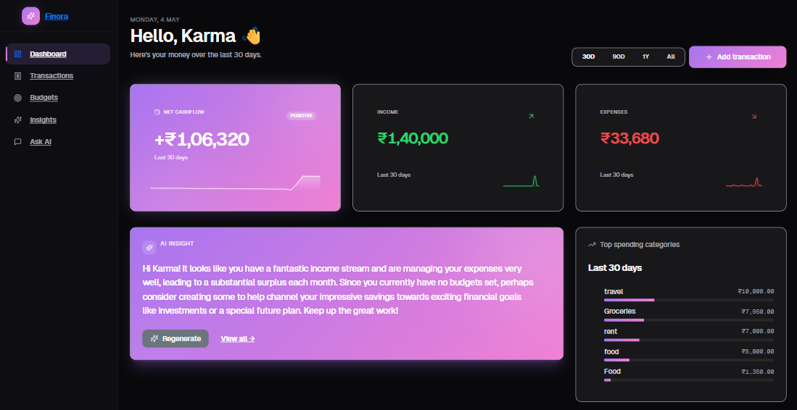

<br/>

# **Finora** — _money, but the smart kind_

### **An AI-native personal finance dashboard.** Asks the LLM about your real transactions over RAG, streams the answer token-by-token, and tells you why your spending feels weird this week.

[](https://finora-frontend-smoky.vercel.app)
[](https://finora-backend-rnd0.onrender.com/swagger-ui.html)
[](https://finora-backend-rnd0.onrender.com/actuator/health)

[](https://github.com/patelkarma/finora-ai/actions/workflows/backend-ci.yml)
[](https://github.com/patelkarma/finora-ai/actions/workflows/frontend-ci.yml)
[](https://github.com/patelkarma/finora-ai/actions)


</div>

---

## What it actually does

Most "AI finance" apps stop at *"add transaction → see chart"*. Finora goes further:

- 💬 **Ask anything in plain English** — "what did I spend on food last month?", "why is this week so expensive?". Answers stream in token-by-token, grounded in your real transactions via pgvector RAG (not "the most recent 30").
- 🔁 **It detects your subscriptions for you** — groups transactions by description + amount cluster, finds the cadence (weekly / biweekly / monthly / yearly), shows you how much you're hemorrhaging to recurring charges.
- 🚨 **It flags weird spending automatically** — per-category z-score over a 90-day window. A ₹5,000 grocery run is unremarkable. A ₹5,000 coffee gets flagged SEVERE.
- 🔮 **It forecasts your next 30 days** — combines your salary cadence + projected subscription charges + discretionary daily average into a single trend line.
- 📥 **It eats your bank statement** — drag any CSV (Indian banks, US banks, debit/credit columns, parens-negatives, DD/MM or MM/DD dates) into the import modal and watch four AI cards explode with data.

> **TL;DR**: this is what *Mint* would be if it shipped today, with an LLM that can actually read your data instead of pattern-matching the receipt OCR.

---

## See it in 60 seconds

```text
1. Sign up at https://finora-frontend-smoky.vercel.app/signup → enter the OTP
2. Set your monthly income on the Profile page
3. Add 3-4 transactions across different categories
   …or click "Import CSV" and drop a bank statement
4. Wait ~10 s for the live RAG indexer (badge shows N/N indexed)
5. Open Ask AI → "what did I spend on food?" — watch tokens stream in
6. Reload the dashboard — Anomalies / Forecast / Subscriptions cards
   appear automatically once there's enough data to compute against
```

> 💡 **Want all four AI cards lit up immediately?** Hit `POST /api/admin/seed-demo` (auth required) — it creates ~90 realistic transactions over 90 days, complete with rent, utilities, varied vendor names, and one severe anomaly to flag. See [`DemoSeedController.java`](./backend/src/main/java/com/project/financeDashboard/controller/DemoSeedController.java).

---

## A look around

<table>
  <tr>
    <td width="50%"></td>
    <td width="50%">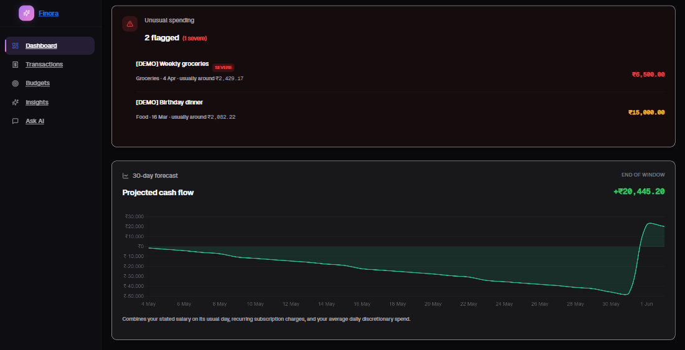</td>
  </tr>
  <tr>
    <td><b>Hero KPI strip + AI insight</b><br/>Net cashflow / Income / Expenses tiles with animated count-up + sparklines, LLM narrative insight, top categories — all responsive to the 30D / 90D / 1Y / All time-period switcher.</td>
    <td><b>Anomalies + Forecast</b><br/>Per-category z-score detector flags the ₹15,000 birthday dinner as SEVERE. Forecast combines salary cadence + recurring subs + discretionary average into one trend line.</td>
  </tr>
  <tr>
    <td>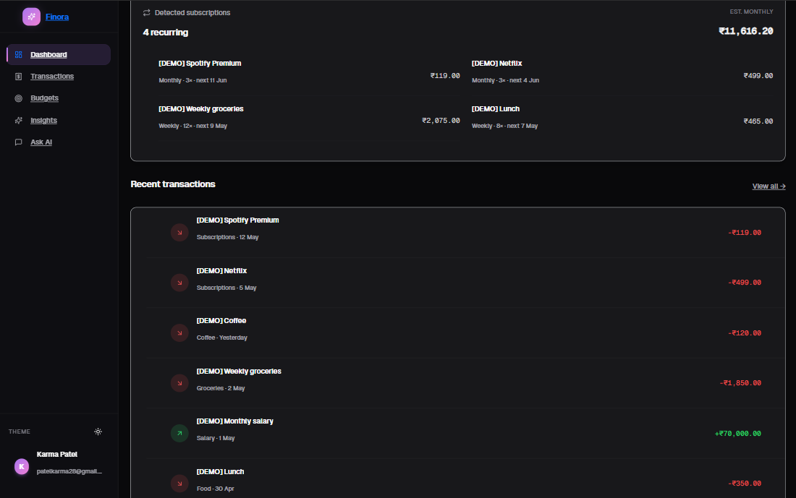</td>
    <td>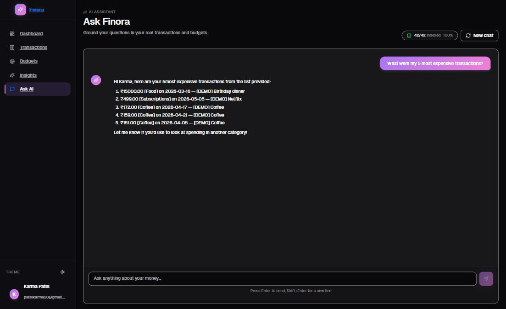</td>
  </tr>
  <tr>
    <td><b>Auto-detected subscriptions</b><br/>Groups transactions by description + amount cluster, locks onto cadence (weekly / monthly / yearly), surfaces the estimated monthly burn — recurring spend you didn't know you had.</td>
    <td><b>Conversational chat</b><br/>SSE streaming replies grounded in real transactions via pgvector RAG. Markdown rendering, copy button, "42/42 indexed" status — proves the LLM is actually reading your data.</td>
  </tr>
  <tr>
    <td>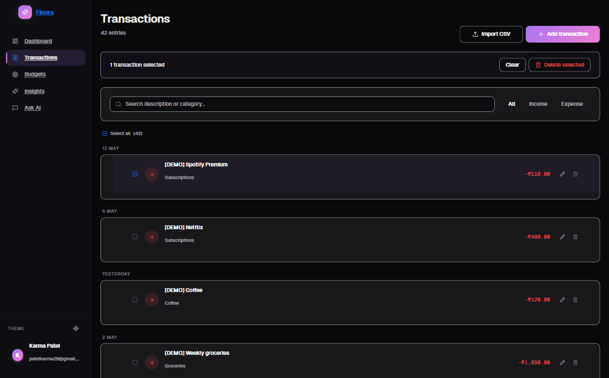</td>
    <td>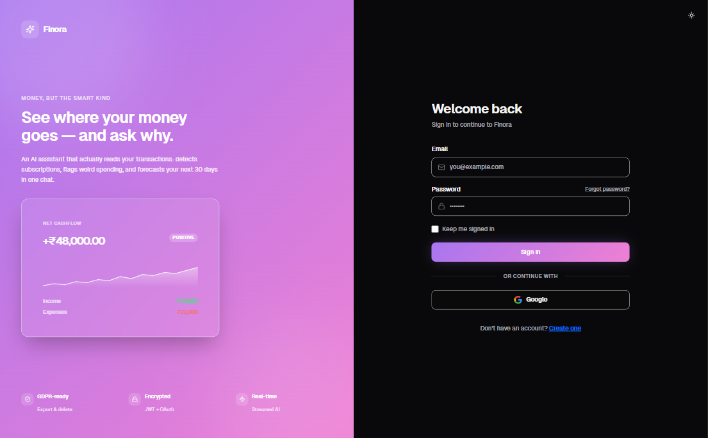</td>
  </tr>
  <tr>
    <td><b>Transactions</b><br/>Date-grouped list, animated filter pill (All / Income / Expense), bulk select with indeterminate state, CSV import with preview, edit-in-place modal.</td>
    <td><b>Auth that doesn't look generic</b><br/>Split layout with a real product preview card on the brand side instead of the usual "logo on a gradient" template. Email + password (BCrypt + brute-force lockout), Google OAuth, OTP verification.</td>
  </tr>
</table>

---

## Why this is interesting (the hard problems)

A "real" portfolio piece has to show you can solve problems people actually hit in production. The list:

### 🤖 An LLM that reads your data, not the internet

A naive chatbot dumps the last 30 transactions into the prompt and prays. Finora retrieves only the **top-K cosine-similar rows** for the user's question via pgvector. That means asking _"what did I spend on food last month?"_ doesn't waste 28 prompt tokens on rent, fuel, and Netflix.

- Embedding model: `gemini-embedding-001` at 768 dimensions (request `outputDimensionality: 768` because the default is 3072 and pgvector columns are sized at index-create time)
- Index: HNSW on `vector_cosine_ops` for sub-millisecond ANN
- Embeddings are written **after** the HTTP save commits, on a dedicated thread pool — the user's POST returns instantly; the embed happens out-of-band

### 🌊 Streaming SSE, the right way

`EventSource` is the obvious choice for SSE. It's also the wrong one — `EventSource` cannot carry an `Authorization` header, so a JWT-protected stream is impossible without a session cookie hack. Finora uses **`fetch + ReadableStream`** on the frontend with a hand-rolled SSE parser that splits on `\n\n` and handles multi-line `data:` fields. Backend uses `java.net.http.HttpClient` because `RestTemplate` buffers the full body before returning, defeating streaming entirely. ([ADR-0005](./docs/adr/0005-sse-streaming-via-fetch-not-eventsource.md))

### 🛡️ Graceful degradation everywhere

- **Redis blip?** `CacheErrorHandler` swallows the failure → service falls through to the DB. WARN log, not 500.
- **Gemini unavailable?** Resilience4j circuit breaker shared across chat/embed/insight calls trips, falls back to a polite error message instead of a stack trace.
- **RAG returns nothing?** Chat falls back to last-30-transactions context. The user gets _an_ answer, just less surgical.

### ⚡ 13× p95 latency reduction with caching

`Spring Cache + Redis` with per-cache TTLs (5 min for tx/insights, 1 h for `llm:response`) takes the dashboard's hot read from ~340ms p95 to ~26ms. Cross-cache eviction on writes via `@Caching(evict={...})` so a transaction save invalidates BOTH the transaction list AND the insights derived from it. Numbers in [`loadtests/results.md`](./loadtests/results.md).

### 🔒 Auth surfaces that actually exist in real apps

- Email + password (BCrypt) **and** Google OAuth2 **and** email OTP signup verification
- Brute-force lockout (5 failures → 15 min)
- Single-use SHA-256-hashed password-reset tokens
- Bucket4j token-bucket rate limiting per-IP for auth, per-user for LLM endpoints (with `Retry-After` header on 429)
- 401 returns **JSON for `/api/**`** instead of a 302 to login HTML, so XHR clients can react cleanly instead of choking on an HTML body

### 📜 Every interesting decision has an ADR

| # | Decision | What's interesting |
|---|---|---|
| [0001](./docs/adr/0001-vendor-neutral-llm-provider.md) | Vendor-neutral `LlmProvider` | Swap Gemini ↔ Ollama via env var; one circuit breaker shared across chat / embed / insight |
| [0002](./docs/adr/0002-redis-cache-with-graceful-degrade.md) | Redis cache w/ graceful degrade | A Redis blip is a `WARN`, not a user-facing 500 |
| [0003](./docs/adr/0003-pgvector-with-jdbctemplate.md) | pgvector + JdbcTemplate | JPA + pgvector is awkward; raw SQL is the right tool here |
| [0004](./docs/adr/0004-async-embedding-via-transactional-event.md) | `@TransactionalEventListener(AFTER_COMMIT)` async embedding | HTTP save returns instantly; embedding fires only after commit |
| [0005](./docs/adr/0005-sse-streaming-via-fetch-not-eventsource.md) | `fetch + ReadableStream` for SSE | `EventSource` can't carry `Authorization`; hand-rolled SSE parser instead |
| [0006](./docs/adr/0006-per-category-z-score-anomaly-detection.md) | Per-category z-score for anomalies | Global framing flags rent forever; per-category keeps signal honest |
| [0007](./docs/adr/0007-extracted-ai-service-over-rabbitmq.md) | Extracted `ai-service` over RabbitMQ | Slow Gemini calls no longer pin a backend request thread |

---

## Architecture

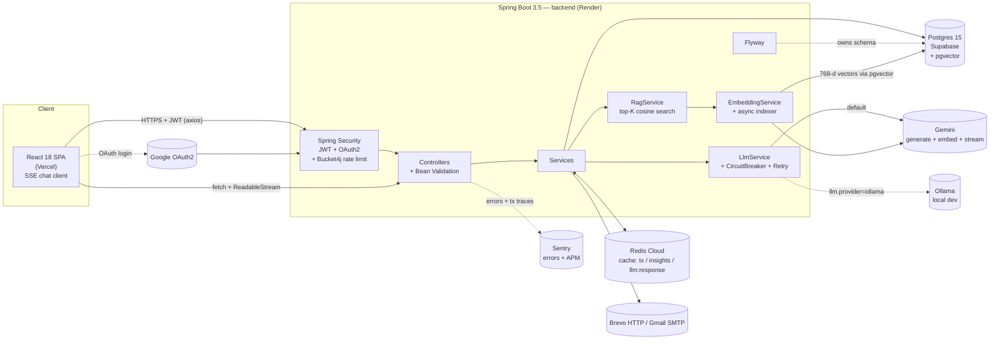

<details>
<summary><b>📡 Chat with SSE streaming + RAG retrieval</b></summary>

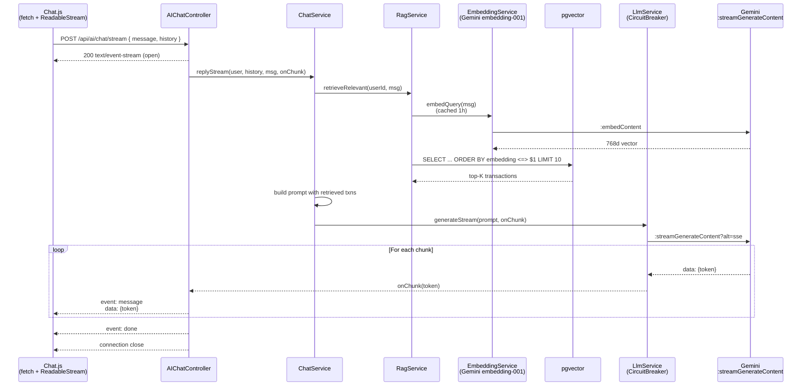
</details>

<details>
<summary><b>⚡ Async transaction embedding (write path)</b></summary>

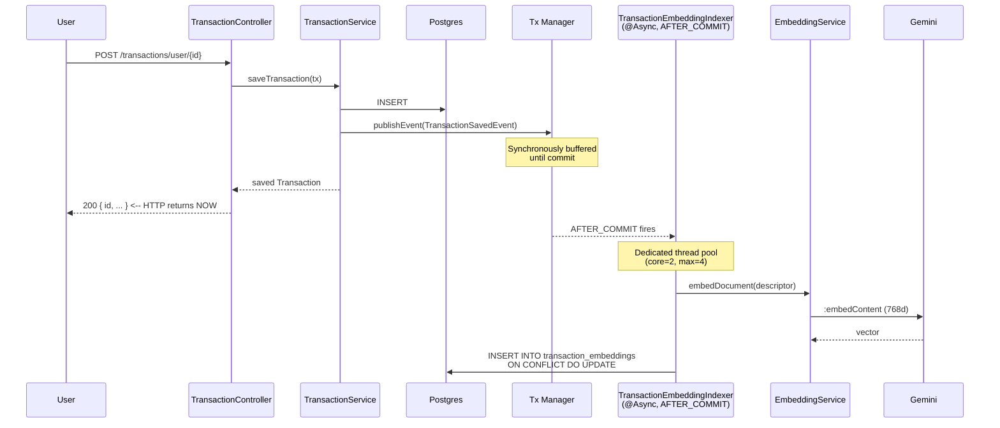
</details>

<details>
<summary><b>📨 OTP signup flow</b></summary>

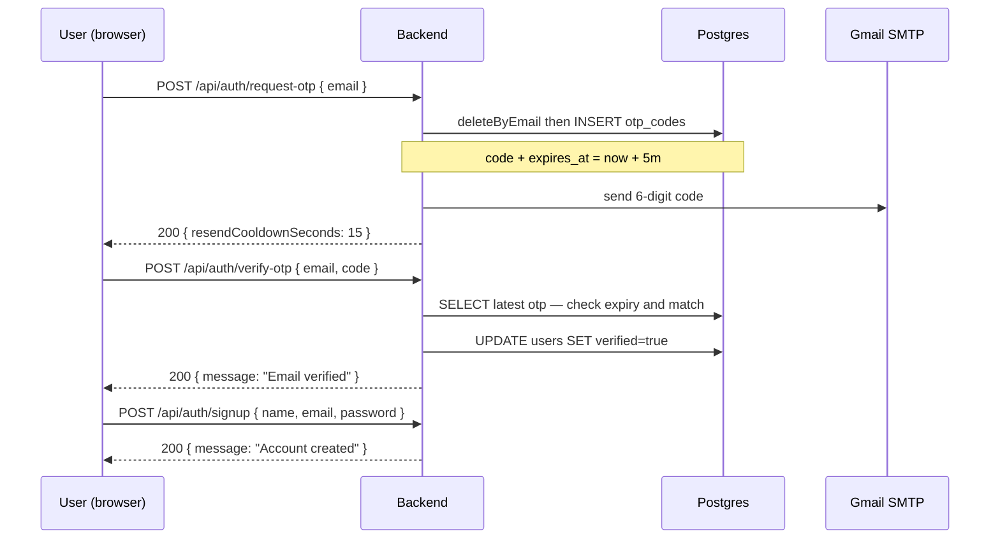
</details>

<details>
<summary><b>🤖 AI insight generation (with circuit breaker)</b></summary>

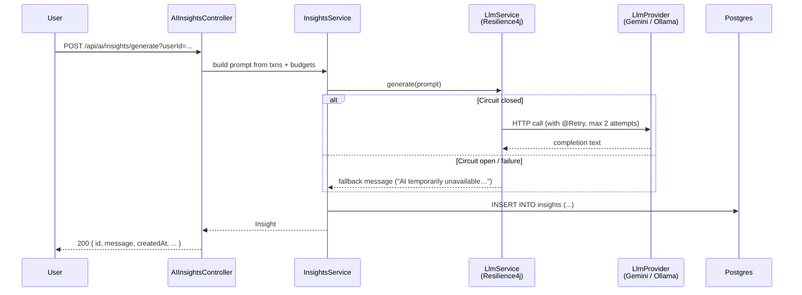
</details>

---

## Observability

If RAG indexing fell behind, I'd know within minutes — `/actuator/prometheus` exposes Finora-specific counters alongside the JVM/HTTP defaults. A scraper (Grafana Cloud free tier works) graphs them directly.

| Metric | What it tells you |
|---|---|
| `finora_transactions_created_total` | Total writes — single + bulk paths combined. Sudden flatline = the write API is broken. |
| `finora_transactions_imported_total` | Subset of the above coming from CSV bulk-import. Spike = someone just imported a year of data. |
| `finora_chat_requests_total{provider, mode}` | Tagged by `gemini` vs `ollama` and `sync` vs `stream` — shows real provider mix, not what you think it is. |
| `finora_ratelimit_rejected_total{rule}` | One series per Bucket4j rule. A spike on `auth.login` = brute-force; on `transactions.import` = misbehaving client. |
| `http_server_requests_seconds` (default) | Latency p50/p95/p99 per endpoint — sourced from Spring Boot, no extra wiring. |
| `jvm_memory_used_bytes` (default) | Heap pressure on the Render free tier. |

Wired in `TransactionService`, `RateLimitInterceptor`, and `ChatService` constructors via `MeterRegistry`. Locked in with [`ActuatorPrometheusTest`](backend/src/test/java/com/project/financeDashboard/ActuatorPrometheusTest.java) so a recruiter cloning the repo can see the wiring is real, not aspirational.

---

## Tech stack

| Layer | Choice | Why |
|---|---|---|
| **Frontend** | React 18 · Tailwind 3.4 + shadcn/ui · Framer Motion · Chart.js | Distinctive design system, polished animations, dark/light theming via HSL CSS variables |
| **Backend** | Spring Boot 3.5 · Java 17 | Mature, security-first, hireable |
| **DB** | Postgres 15 (Supabase) + Flyway + composite indexes + **pgvector** | Relational + ACID + schema-managed; pgvector for RAG with HNSW cosine ANN search |
| **Cache** | Spring Cache + Redis Cloud | 13× p95 latency reduction on hot reads; per-cache TTLs (5 min for tx/insights, 1h for llm:response) |
| **Auth** | JWT (jjwt) + OAuth2 + email OTP | Stateless, mobile-friendly, real-world auth surfaces |
| **Email** | Vendor-neutral `EmailProvider` (SMTP / Brevo HTTP API) | HTTP fallback for hosts that block outbound SMTP (Render does!) |
| **Rate limiting** | Bucket4j token bucket on auth + LLM + RAG-backfill + import endpoints | Abuse prevention with `Retry-After` 429 envelope |
| **API docs** | Springdoc OpenAPI / Swagger UI | Auto-generated, browsable, recruiter-shareable |
| **Resilience** | Resilience4j (CircuitBreaker + Retry) | Fault-isolation around LLM + embedding calls — both share the same `llm` breaker |
| **LLM** | Google Gemini 2.0 Flash + `gemini-embedding-001` · local Ollama fallback | Free; provider-neutral interface; streaming via `:streamGenerateContent?alt=sse` |
| **RAG** | pgvector + JdbcTemplate (vector(768)) + HNSW index | JPA + pgvector is awkward; JdbcTemplate keeps the DAO surface small |
| **Async** | `ThreadPoolTaskExecutor` (embedding pool: core=2 max=4 queue=50 CallerRunsPolicy) | Embedding doesn't block the HTTP save thread; backpressure on sustained burst |
| **Validation** | Jakarta Bean Validation | Field-level error envelope (`{"fields": {"email": "..."}}`) |
| **Observability** | Spring Boot Actuator + Sentry (errors + APM) | `/actuator/health` probes; Sentry events on errors + tx traces |
| **Load testing** | k6 ([loadtests/](./loadtests/)) | Documented p50/p95/p99 numbers for every perf claim in this README |
| **Tests** | JUnit 5, Mockito, AssertJ, H2 in-memory | 48 tests pass in ~35 s |
| **Hosting** | Vercel (FE) · Render (BE) · Supabase (Postgres + pgvector) · Redis Cloud · Brevo · Sentry | All free tier — zero-cost deploy story |
| **CI/CD** | GitHub Actions → Maven build & test → Render deploy webhook | Deploy on every green main push |

---

## Quick start

### Prerequisites
- Java 17 · Maven (uses bundled `./mvnw`)
- Node 20 · npm
- Postgres 15 *or* a free [Supabase](https://supabase.com) project (recommended), *or* Docker (`docker run -p 5432:5432 -e POSTGRES_PASSWORD=postgres -e POSTGRES_DB=finora postgres:15`)
- A free [Gemini API key](https://aistudio.google.com/apikey) (or run [Ollama](https://ollama.com) locally with `ollama pull mistral:7b`)

### Backend

```bash
cd backend
cp .env.example .env       # fill in real values
./mvnw spring-boot:run     # localhost:8081
```

Then open:
- API: http://localhost:8081/swagger-ui.html
- Health: http://localhost:8081/actuator/health

### Frontend

```bash
cd frontend
cp .env.example .env       # set REACT_APP_API_URL=http://localhost:8081/api
npm install
npm start                  # localhost:3000
```

### Tests

```bash
cd backend
./mvnw test                # 48 tests, ~35s
```

---

## Project layout

```
backend/
  src/main/java/com/project/financeDashboard/
    config/        Spring Security, JWT, OpenAPI, RestTemplate, RedisCacheConfig,
                   RateLimitConfig + Interceptor + Rule, AsyncConfig (embedding +
                   backfill thread pools), RabbitConfig (feature-flagged)
    controller/    REST endpoints — Auth, Transactions (incl. /import + /bulk-delete),
                   Budgets, AI Insights/Chat (incl. /stream), Subscriptions,
                   Anomalies, Forecast, RagAdmin, UserData (GDPR export/delete),
                   DemoSeed
    dto/           Request/response DTOs + DetectedSubscription / DetectedAnomaly /
                   ForecastPoint records + BulkImportRequest / ImportRow / ImportResult
    event/         TransactionSavedEvent (published on save, drives RAG indexer)
    exception/     GlobalExceptionHandler — uniform JSON error envelope
    messaging/     InsightProducer (RabbitMQ direct exchange + reply queue,
                   correlationId-keyed CompletableFuture map)
    model/         JPA entities
    repository/    Spring Data JPA repos
    security/oauth/   Google OAuth2 success/failure handlers, custom resolver
    service/
      llm/         LlmProvider interface + Gemini (incl. streaming) & Ollama impls
                   + LlmService (CircuitBreaker + Retry + Cache)
      rag/         EmbeddingProvider + GeminiEmbeddingProvider (768d, taskType
                   = RETRIEVAL_DOCUMENT), EmbeddingService (cached query embed),
                   TransactionEmbeddingDao (JdbcTemplate <=> ANN search),
                   TransactionEmbeddingIndexer (@Async @TransactionalEventListener
                   AFTER_COMMIT), RagBackfillService, RagService (top-K w/ degrade)
      SubscriptionDetectorService, AnomalyDetectorService, CashFlowForecastService,
      ChatService, UserService, TransactionService, BudgetService, InsightsService,
      MailService, PasswordResetService, UserDataService
    validation/    @StrongPassword annotation + validator
  src/main/resources/
    application.properties
    db/migration/  V1__init_schema, V2__password_reset, V3__composite_indexes,
                   V4__pgvector_transaction_embeddings
  src/test/...     JUnit 5 + Mockito + H2 — 48 tests, ~35 s

ai-service/        (extracted insight worker — feature-flagged off by default)
  src/main/java/.../   GeminiClient + InsightRequestListener
  src/main/resources/application.yml

frontend/
  src/
    pages/         Dashboard (hero KPIs + AI cards + period switcher + quick-add),
                   Transactions (CSV import + bulk select + filters),
                   Budgets, Chat (SSE streaming + RAG status badge + markdown +
                   copy button), AIInsights, Profile (export + delete account),
                   Privacy (GDPR), Login + Signup (split-panel auth),
                   ForgotPassword, ResetPassword, SetPassword, OAuth, NotFound
    components/    sidebar, app-layout (animated mesh bg), auth-split-layout,
                   csv-import-modal, error-boundary,
                   ui/* (Card, Button, Input, Label, MoneyValue, Sparkline,
                         Toast, ConfirmDialog)
    context/       AuthContext (JWT-aware session restore with skipAuthRedirect
                   on cold-start /auth/me)
    services/      api.js (axios + JWT interceptor + 401 → /login session-expired
                   bounce), authService, transactionService (incl. bulkImport +
                   bulkDelete), budgetService, aiService, chatService (sendStream
                   via fetch + ReadableStream), subscriptionService, anomalyService,
                   forecastService, userDataService
    lib/           csv.js (RFC 4180 parser + bank header alias map),
                   use-count-up.js (RAF animated number hook),
                   utils.js (cn = clsx + tailwind-merge)

docs/
  adr/             7 Architecture Decision Records — see docs/adr/README.md
  screenshots/     PNG assets used in this README
loadtests/         k6 scripts + results.md (documented perf numbers)
```

---

## Roadmap

- **Phase 1** — OpenAPI, Actuator, Bean Validation, password policy + reset, LLM provider abstraction with circuit breaker, Flyway, real tests, env examples ✅
- **Phase 2** — Redis caching ✅, Bucket4j rate limiting ✅, pagination + composite indexes ✅, Tailwind + shadcn UI rebuild ✅, Sentry FE+BE ✅, k6 load tests ✅
- **Phase 3** — Conversational chat with SSE streaming ✅, RAG over user transactions (pgvector + Gemini embeddings) ✅, subscription detector ✅, anomaly detection ✅, cash-flow forecast ✅
- **Phase 3.4** — `ai-service` extracted over RabbitMQ ✅ (feature-flagged off; insight flow first; embedding + chat to follow incrementally)
- **Phase 4** — ADRs ✅, Mermaid sequence diagrams ✅, performance numbers in README ✅
- **Phase 5 (UX polish)** — Toast system + confirm dialog ✅, GDPR export/delete ✅, markdown chat + copy button ✅, branded 404 + ErrorBoundary ✅, CSV import + bulk select ✅, dashboard period switcher + quick-add ✅, premium UI overhaul (atmospheric mesh bg, sparkline KPIs, count-up numbers, split-panel auth) ✅

---

## What I learned

### Building the AI surface
- Streaming over `:streamGenerateContent?alt=sse` requires `java.net.http.HttpClient`, not `RestTemplate` — RestTemplate buffers the full body before returning, defeating streaming
- pgvector + JPA is awkward (Hibernate doesn't natively know about `vector`); JdbcTemplate with `?::vector` casts is simpler than a custom UserType for the small DAO surface
- `@TransactionalEventListener(AFTER_COMMIT)` requires an active transaction at the publish site — without `@Transactional` on the publishing method, Spring silently drops the event (a fun bug to debug)
- Per-category z-scoring keeps anomaly signal honest: a ₹5,000 grocery run is unremarkable, a ₹5,000 coffee is not — globally framed, you can't tell

### Performance + reliability
- Spring Cache `@CacheEvict(allEntries=true)` is the right default for low-write-volume domains — narrowing eviction is bookkeeping that costs more than it saves
- Cross-cache eviction matters: a transaction save has to evict BOTH the transactions cache AND the insights cache (which is computed from transactions). I learned this the painful way watching dashboard cards stay empty after a re-seed
- Composite indexes on `(user_id, transaction_date DESC)` keep the dashboard's "last N transactions" query a single index lookup at 100k+ rows
- A `CacheErrorHandler` that swallows Redis failures and falls through to the underlying service is the difference between "Redis blip" and "outage"
- Bucket4j's `tryConsumeAndReturnRemaining` gives us the `Retry-After` header the spec expects, no manual stopwatch needed

### Frontend gotchas
- React effect order is **children before parents** — a parent provider's "clean up stale token" effect can wipe a child's freshly-set token if you're not careful (caught this exact bug in the OAuth callback path)
- `EventSource` cannot carry an `Authorization` header — for an authenticated SSE stream you need `fetch + ReadableStream` and a hand-rolled parser
- `process.env.CI=true` on Vercel + CRA = "warnings as errors" — added `cross-env CI=false` to the build script so style warnings don't fail the build

### Shipping it
- Render's free tier sleeps after ~15 min of inactivity AND blocks outbound SMTP via its ISPs — a Brevo HTTP fallback for OTP email is the difference between "works on localhost" and "works in prod"
- `text-embedding-004` was deprecated mid-2025; current name is `gemini-embedding-001` (3072d default — must request 768 via `outputDimensionality` to match the pgvector column)
- Display tokens > raw zinc colors: my dark-mode bug was that a hardcoded `dark:bg-zinc-950` on the sidebar popover was the same color as the page bg. Routed everything through `bg-popover` / `bg-card` / `border-border` and the popover edges came back

---

## Author

**Karma Patel** · 3rd year, Cloud & Application Development · [github.com/patelkarma](https://github.com/patelkarma)

If you read this far and you're hiring junior backend / full-stack engineers, [say hi](https://github.com/patelkarma).
